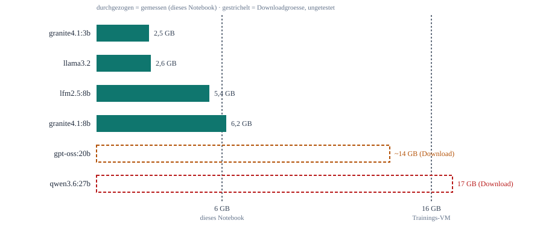

# Einfuehrung in LLM-Architekturen

Kurzer konzeptioneller Hintergrund, keine Uebung. Ziel: verstehen, was hinter einem Ollama-Tag
wie `granite4.1:8b` steckt, und warum Modellgroesse eine harte Hardware-Entscheidung ist, nicht
nur eine Qualitaetsfrage.

## Vom Training zur Ollama-Modelldatei

Ein grosses Sprachmodell entsteht in mehreren Stufen, bevor es als Ollama-Modell nutzbar ist:

1. **Pretraining**: Das Modell lernt auf riesigen Textmengen, Sprache statistisch fortzusetzen -
   das Ergebnis sind die Modellgewichte (Milliarden Zahlen, siehe
   [transformer-prinzip.md](transformer-prinzip.md) fuer den Mechanismus dahinter).
2. **Instruction-Tuning**: Das vortrainierte Modell wird zusaetzlich darauf trainiert, Anweisungen
   zu befolgen statt nur Text fortzusetzen - das macht aus einem reinen Textvervollstaendiger
   einen Chat-Assistenten. Modelle mit Tool-Calling (wie `granite4.1:8b`) bekommen in diesem
   Schritt zusaetzlich das Format fuer Funktionsaufrufe beigebracht.
3. **Quantisierung**: Die Gewichte werden von hoher Praezision (z.B. 16-Bit) auf niedrigere
   Praezision (meist 4-Bit) reduziert, um Speicherbedarf zu senken - Details dazu in
   [produktion/quantisierung-und-performance.md](../produktion/quantisierung-und-performance.md).
   Ollama-Tags wie `granite4.1:8b` sind bereits quantisiert; das "8b" bezieht sich auf die
   Parameterzahl (8 Milliarden), nicht auf die Dateigroesse.

Fuer den Ollama-Alltag ist nur das Ergebnis relevant: eine fertige, quantisierte Modelldatei mit
einer bestimmten Parameterzahl - und genau die Parameterzahl bestimmt den VRAM-Bedarf.

## Parameterzahl = VRAM-Bedarf

*VRAM-Bedarf der in diesem Training relevanten Modelle. Die ersten vier Werte sind mit
`ollama ps` auf diesem 6-GB-Notebook gemessen (siehe
[ollama/erste-inbetriebnahme.md](../ollama/erste-inbetriebnahme.md)); die letzten beiden sind
ungetestete Downloadgroessen, da sie hier nicht passen.*

Drei Faelle ergeben sich direkt aus dem Diagramm:

- **Passt ueberall** (granite4.1:3b bis granite4.1:8b): laeuft schon auf diesem Notebook, damit
  erst recht auf einer 16-GB-Trainings-VM.
- **Passt nur auf die Trainings-VM** (gpt-oss:20b): Kandidat fuer Tag 3, aber erst testbar, wenn
  eine NobleProg-VM mit 16 GB VRAM verfuegbar ist.
- **Passt nirgends** (qwen3.6:27b): bewusst als Gegenbeispiel aufgefuehrt - zeigt, dass
  "neueres/groesseres Modell" nicht automatisch "einsetzbares Modell" bedeutet.

## Warum das die Modellwahl bestimmt, nicht nur die Qualitaet

Die Tool-Calling-Modellwahl fuer Tag 2 (siehe
[ollama/modelle.md](../ollama/modelle.md)) war nicht "welches Modell ist am besten", sondern
"welches Modell erfuellt die Anforderung (Tool-Calling, korrekte deutsche Antworten) **und**
passt in die verfuegbare Hardware". Genau diese zwei Fragen - Qualitaet und Hardware-Passung -
sind bei jeder Modellauswahl in der Praxis zu trennen.
