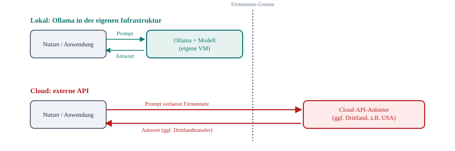

# Lokale Nutzung vs. Cloud (DSGVO-Einordnung)

Kurzer konzeptioneller Hintergrund, keine Uebung. Ziel: verstehen, welchen konkreten
Unterschied "lokal mit Ollama" gegenueber "Cloud-API" fuer den Datenschutz macht - nicht als
abstrakte Regel, sondern als sichtbarer Unterschied im Datenfluss.

*Der einzige strukturelle Unterschied: Bei Ollama bleibt der Pfeil (Prompt/Antwort) innerhalb
der Firmennetz-Grenze. Bei einer Cloud-API ueberquert derselbe Pfeil die Grenze - in beide
Richtungen, bei jeder einzelnen Anfrage.*

## Was das fuer die DSGVO bedeutet

- **Lokal (Ollama):** Der Prompt - der personenbezogene Daten enthalten kann (Namen,
  Kundendaten, interne Vorgaenge, siehe auch das Audit-Log-Beispiel in
  [produktion/logging-und-audit.md](../produktion/logging-und-audit.md)) - verlaesst nie die
  eigene Infrastruktur. Es gibt keinen Auftragsverarbeiter im datenschutzrechtlichen Sinne, weil
  niemand ausserhalb der eigenen Organisation die Daten verarbeitet.
- **Cloud-API:** Jeder Prompt geht an einen externen Anbieter. Das ist nicht automatisch
  verboten, aber es macht den Anbieter zum **Auftragsverarbeiter** (Art. 28 DSGVO, Vertrag
  noetig) - und wenn der Anbieter (oder dessen Subunternehmer, z.B. Rechenzentren) in einem
  Drittland ausserhalb der EU sitzt, kommen zusaetzlich die Anforderungen fuer
  **Drittlandtransfers** (Art. 44 ff. DSGVO, z.B. Standardvertragsklauseln) dazu.

## Praxisfolgen

- Bei lokalem Betrieb entfaellt die Frage "wo genau verarbeitet der Anbieter meine Daten"
  komplett - es gibt keinen Anbieter im Verarbeitungspfad.
- Das ist kein Freifahrtschein: Wer intern Zugriff auf Ollama hat und was protokolliert wird,
  ist trotzdem regelungsbeduerftig - siehe
  [produktion/sicherheit-und-zugriff.md](../produktion/sicherheit-und-zugriff.md) und
  [produktion/logging-und-audit.md](../produktion/logging-und-audit.md). Lokal loest nicht
  automatisch DSGVO-Konformitaet, es reduziert aber die Zahl der beteiligten Parteien auf eine
  einzige: die eigene Organisation.
- Diese Abwaegung - volle Kontrolle vs. Aufwand fuer eigenen Betrieb - ist einer der
  Hauptgruende, warum dieses Training ueberhaupt auf Ollama statt auf eine Cloud-API setzt.
