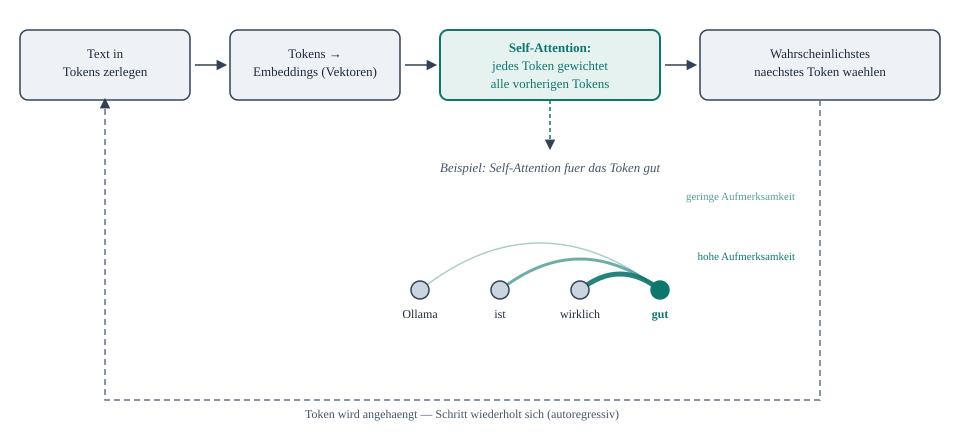

# Transformer-Prinzip (Ueberblick)

Kurzer konzeptioneller Hintergrund, keine Uebung - Ziel ist das Warum hinter Dingen, die ab
Tag 1 praktisch schon vorkamen (Kontextfenster/`num_ctx` in
[ollama/modelle.md](../ollama/modelle.md)) und ab Tag 2 wichtig werden (Embeddings in
[rag/embeddings-und-vektordatenbank.md](../rag/embeddings-und-vektordatenbank.md)).

## Die Kernidee: Self-Attention

Vor Transformern (bis ca. 2017) verarbeiteten Sprachmodelle Text Wort fuer Wort in fester
Reihenfolge (RNNs) - langsam und schlecht darin, weit zurueckliegende Woerter im Satz noch
"im Kopf" zu haben. Transformer loesen das mit **Self-Attention**: Jedes Token berechnet direkt,
wie relevant *jedes andere* Token im bisherigen Text fuer die eigene Bedeutung ist - unabhaengig
von der Entfernung im Text.

Ein Sprachmodell erzeugt Antworten **ein Token nach dem anderen** (autoregressiv): Text wird in
Tokens zerlegt, jedes Token wird zu einem Vektor (Embedding), Self-Attention gewichtet den
bisherigen Kontext, daraus ergibt sich eine Wahrscheinlichkeit fuer das naechste Token - das
wird an den Text angehaengt, und der ganze Schritt wiederholt sich fuer das Token danach.

*Ein Sprachmodell erzeugt jeweils ein Token, haengt es an den bisherigen Text an und wiederholt
den Vorgang. Im Beispiel gewichtet das Token "gut" die vorherigen Tokens unterschiedlich stark -
"wirklich" direkt davor bekommt mehr Gewicht als das weiter zurueckliegende "Ollama".*

## Warum das fuer die Praxis relevant ist

- **Kontextfenster (`num_ctx`):** Self-Attention vergleicht jedes Token mit jedem anderen Token
  im Kontext - der Rechenaufwand waechst nicht linear, sondern quadratisch mit der
  Kontextlaenge. Das ist der Grund, warum ein groesseres `num_ctx` (siehe
  [ollama/modelle.md](../ollama/modelle.md)) nicht "kostenlos" ist, sondern mehr VRAM und
  Rechenzeit braucht.
- **Embeddings (Tag 2):** Die Vektoren, die Self-Attention miteinander vergleicht, sind
  strukturell dasselbe Prinzip wie die Embeddings, die
  [nomic-embed-text](../rag/embeddings-und-vektordatenbank.md) fuer die RAG-Suche erzeugt -
  Bedeutung als Vektor, Aehnlichkeit als messbarer Abstand.
- **Warum Modelle "verstehen", was gemeint ist:** Ohne Self-Attention muesste ein Modell raten,
  worauf sich z.B. ein Pronomen bezieht. Mit Self-Attention kann es direkt zurueckschauen -
  das ist ein Kerngrund, warum aktuelle Sprachmodelle so viel kohaerenter wirken als
  Vorgaenger-Architekturen.

## Kein Grund zur Sorge

Fuer den Betrieb mit Ollama muss niemand Self-Attention selbst implementieren - das ist alles
schon in den Modellgewichten "eingebaut". Wichtig ist nur das Kostenmodell (mehr Kontext = mehr
Rechenaufwand), damit `num_ctx`-Entscheidungen in [ollama/modelle.md](../ollama/modelle.md) und
in [produktion/ressourcenmanagement.md](../produktion/ressourcenmanagement.md) nicht "aus dem
Bauch" getroffen werden.
