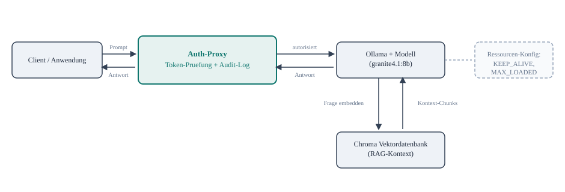

# Architekturentscheidungen

Kurzer Ueberblick, keine eigene Uebung - fasst zusammen, wie die einzelnen Tag-2/Tag-3-Bausteine
in einer produktionsnahen Architektur zusammenspielen, bevor im Abschlussprojekt alles selbst
zusammengebaut wird.

*Jede Anfrage durchlaeuft den Auth-Proxy (Token-Pruefung, siehe
[sicherheit-und-zugriff.md](sicherheit-und-zugriff.md), plus Audit-Log, siehe
[logging-und-audit.md](logging-und-audit.md)), bevor sie ueberhaupt Ollama erreicht. Ollama
selbst holt sich bei Bedarf RAG-Kontext aus Chroma und wird ueber Umgebungsvariablen
(siehe [ressourcenmanagement.md](ressourcenmanagement.md)) gesteuert.*

## Die vier Architekturentscheidungen im Zusammenhang

Jeder Kasten im Diagramm steht fuer eine Entscheidung, die in diesem Training schon einzeln
getroffen und getestet wurde:

1. **Wo laeuft das Modell?** Lokal mit Ollama statt Cloud-API (siehe
   [grundlagen/lokal-vs-cloud-dsgvo.md](../grundlagen/lokal-vs-cloud-dsgvo.md)) - Ollama ist
   deshalb der zentrale Knoten im Diagramm, nicht irgendein externer Dienst.
2. **Wer darf zugreifen?** Ollama selbst hat keine Authentifizierung - der Auth-Proxy davor ist
   keine Optimierung, sondern die Grundvoraussetzung fuer jeden Betrieb ausserhalb eines
   einzelnen Laptops.
3. **Was passiert mit Wissen, das nicht in den Modellgewichten steckt?** Chroma als
   RAG-Baustein statt Fine-Tuning (siehe
   [rag/rag-vs-finetuning.md](../rag/rag-vs-finetuning.md)) - deshalb ist Chroma ein
   eigenstaendiger Kasten neben Ollama, nicht Teil des Modells selbst.
4. **Wie viele Modelle laufen gleichzeitig, wie lange bleiben sie geladen?** Die
   Ressourcen-Konfiguration ist bewusst als eigener, loser gekoppelter Kasten dargestellt - sie
   greift direkt in Ollamas Verhalten ein, ohne dass Client oder Proxy davon etwas merken.

## Eine Architekturentscheidung, die hier bewusst NICHT getroffen wird

Das Diagramm zeigt eine einzelne Ollama-Instanz. Bei mehreren gleichzeitigen Nutzern oder
Hochverfuegbarkeitsanforderungen kaeme als naechste Entscheidung Skalierung dazu (mehrere
Ollama-Instanzen, Load-Balancing) - das ist bewusst ausserhalb des Trainingsumfangs (siehe
[projekt/abschlussprojekt.md](../projekt/abschlussprojekt.md), Abschnitt "Nicht gefordert").
