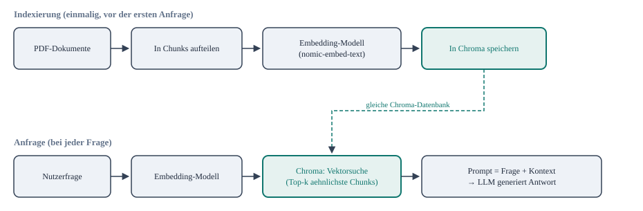

# Architektur von Retrieval Augmented Generation

Kurzer konzeptioneller Ueberblick, keine eigene Uebung - das grosse Bild, bevor die einzelnen
Bausteine in [embeddings-und-vektordatenbank.md](embeddings-und-vektordatenbank.md),
[pdf-integration.md](pdf-integration.md) und
[../projekt/rag-chatbot.md](../projekt/rag-chatbot.md) hands-on gebaut werden.

*RAG besteht aus zwei getrennten Phasen, die denselben Chroma-Speicher teilen: einmaliges
Indexieren der Dokumente (oben) und wiederholte Anfragen (unten). Die Vektorsuche in der
unteren Reihe funktioniert nur, weil in der oberen Reihe vorher schon Chunks mit demselben
Embedding-Modell eingebettet wurden.*

## Warum zwei getrennte Phasen?

Der haeufigste Anfaengerfehler ist, Indexierung und Anfrage als einen Vorgang zu denken. Sie
sind bewusst getrennt:

- **Indexierung** ist teuer (PDF einlesen, chunken, jeden Chunk einbetten) - passiert aber nur
  einmal pro Dokument, nicht bei jeder Frage.
- **Anfrage** ist guenstig (nur die Frage selbst wird eingebettet, dann eine Vektorsuche in der
  bereits fertigen Datenbank) - das ist es, was bei jeder einzelnen Chat-Nachricht neu passiert.

Genau deshalb baut [pdf-integration.md](pdf-integration.md) die Chroma-Datenbank mit
`persist_directory` einmal auf, und
[../projekt/rag-chatbot.md](../projekt/rag-chatbot.md) laedt sie in der Chat-Schleife nur noch
wieder - ohne bei jeder Frage neu zu indexieren.

## Die zwei Stellschrauben, die alles bestimmen

1. **Wie wird gechunkt?** Zu kleine Chunks reissen Zusammenhaenge auseinander, zu grosse
   vermischen Themen - siehe das konkrete Beispiel in
   [pdf-integration.md](pdf-integration.md), "Chunk-Grenzen beachten".
2. **Wie viele Chunks werden abgerufen (`k`)?** Zu wenige Chunks liefern nicht genug Kontext,
   zu viele verwaessern den Prompt mit irrelevantem Text und kosten unnoetig Kontextfenster
   (siehe [../grundlagen/transformer-prinzip.md](../grundlagen/transformer-prinzip.md) - jedes
   zusaetzliche Token im Kontext kostet Rechenzeit).

Alles danach - der eigentliche Generierungsschritt - ist einfach ganz normales Prompting mit
Grounding, wie schon in [../prompting/grundlagen.md](../prompting/grundlagen.md) gezeigt: RAG
automatisiert nur die Suche nach dem passenden Kontext, nicht die Generierung selbst.
