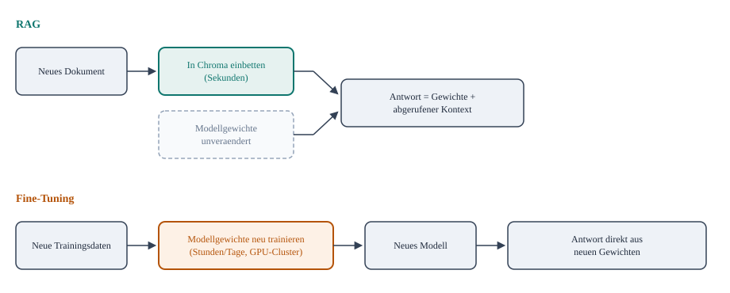

# Vergleich RAG vs. Fine-Tuning

Kurzer konzeptioneller Hintergrund, keine Uebung - beide Wege bringen einem Sprachmodell neues
Wissen bei, aber auf strukturell unterschiedliche Art.

*Der zentrale Unterschied: Bei RAG bleiben die Modellgewichte waehrend der gesamten Nutzung
unangetastet - neues Wissen kommt erst zur Anfragezeit als Kontext dazu. Bei Fine-Tuning
verschwindet dieser Schritt komplett; das Wissen steckt vorher schon fest in einem neuen
Gewichte-Set.*

## Was das praktisch bedeutet

| | RAG | Fine-Tuning |
|---|---|---|
| Wo lebt das neue Wissen? | In der Vektordatenbank (Chroma) | In den Modellgewichten selbst |
| Update-Aufwand | Dokument in Chroma einbetten (Sekunden, siehe [embeddings-und-vektordatenbank.md](embeddings-und-vektordatenbank.md)) | Neuer Trainingslauf (Stunden bis Tage, eigene GPU-Kapazitaet) |
| Nachvollziehbarkeit | Antwort lässt sich auf konkrete Quellenchunks zurueckfuehren (siehe [pdf-integration.md](pdf-integration.md)) | Antwort kommt aus den Gewichten - welche Trainingsdaten dazu gefuehrt haben, ist nicht mehr direkt nachvollziehbar |
| Veraltetes Wissen entfernen | Dokument aus Chroma loeschen | Nur durch erneutes Training korrigierbar |
| Setup-Aufwand | Embedding-Modell + Vektordatenbank (schon in diesem Training aufgebaut) | Trainingsinfrastruktur, Trainingsdaten-Kuratierung, ML-Know-how |

## Warum dieses Training auf RAG setzt

Fuer den Use-Case "eigene Dokumente durchsuchbar machen" (siehe
[pdf-integration.md](pdf-integration.md) und
[projekt/rag-chatbot.md](../projekt/rag-chatbot.md)) ist RAG fast immer die richtige Wahl:
Dokumente aendern sich staendig, und niemand will nach jeder Aenderung ein Modell neu
trainieren. Fine-Tuning lohnt sich eher, wenn es nicht um *Wissen*, sondern um *Verhalten* geht -
z.B. ein Modell soll durchgehend einen bestimmten Tonfall oder ein festes Ausgabeformat lernen,
unabhaengig vom jeweiligen Dokumentinhalt. Beides schliesst sich nicht aus: In der Praxis werden
RAG und Fine-Tuning teils kombiniert.
